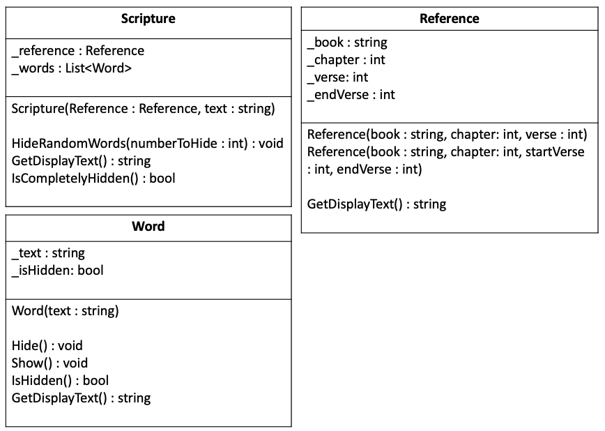

# What does the program do?

- Whenever we hit the spacebar , it will eventually cause the program to finish
- Each time the spacebar is pressed, more random words disappear
- When user types quit (or q) the program ends immediately
- 1st list -> Scripture List -> Contain a scripture eg. Genesis 1:3
- 2nd list -> Random Number -> Insert scripture into the scripture, replaces in position to scripture

# What user inputs does it have?
- spacebar or type q(quit)
- Extra credit: Bring last hidden words back

# What output does it produce?
- output the scripture (initially).
- output the message, type quit or q
- replaces the words with _ (underscores)

# How does the program end?
- q or quit or all the words in scripture has been hidden


# Determine The Classes behavior, attributes  


## Name of classes
- Scripture -> Keeps track of both the reference and the text of the scripture. Can hide words and get the rendered display 
    of the text.
- Reference -> Keeps track of the book, chapter, and verse information. ✅
- Word -> Keeps track of a single word and whether it is shown or hidden.
- Hider -> class that has the responsibility for hiding the words in the scripture.

### Behavior of Scripture Class
- HideRandomWords(numberToHide : int) : void
- GetDisplayText() : string
- IsCompletelyHidden() : bool

### Behaviour of Word Class
- Hide() : void
- Show() : void
- IsHidden() : bool
- GetDisplayText() : string

### Behaviour of Reference Class
- GetDisplayText() : string
- Possible getters and setters

## Name of Attributes Of Class scripture, reference, word

### Scripture
``` Csharp
    _reference : Reference
    _words : List<Word>

```
### Reference
``` Csharp
    _book : string
    _chapter : int
    _verse : int
    _endVerse : int

```

### Word

``` Csharp
    _text : string
    _isHidden : bool

```


# Constructors For Scripture, Reference and Word
- Scripture -> At least 1 constructor needed
- Reference ->  Reference should have two different constructors to account for cases where there is a single verse or multiple verses. 
- Word -> A class for a Word will need a constructor as well. This constructor should accept the text of the word to save it as an attribute. 


# A final picture of everything

